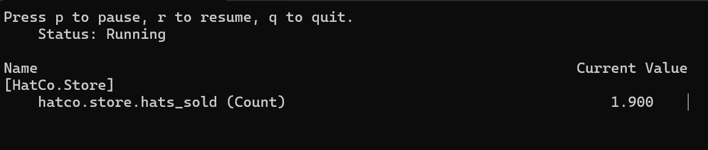

# Questão
Realize as atividades propostas no tutorial "Criando métricas". Você deverá criar um repositório no github e implementar todas as etapas. Crie um arquivo markdown e registre, em forma de relatório, o seu avanço. Adicione ao relatório prints da execução do seu programa exibindo as saidas do console/terminal.

# Passo 1 - Criar uma métrica personalizada
- Criação do aplicativo com os comandos:
```
  dotnet new console
  dotnet add package System.Diagnostics.DiagnosticSource
```
- E adicione esse código em Progrma.cs
  
```
  using System;
  using System.Diagnostics.Metrics;
  using System.Threading;

  class Program
  {
      static Meter s_meter = new Meter("HatCo.Store");
      static Counter<int> s_hatsSold = s_meter.CreateCounter<int>("hatco.store.hats_sold");

      static void Main(string[] args)
      {
          Console.WriteLine("Press any key to exit");
          while(!Console.KeyAvailable)
          {
              // Pretend our store has a transaction each second that sells 4 hats
              Thread.Sleep(1000);
              s_hatsSold.Add(4);
          }
      }
  }
```

- Coloque esse comando no terminal:

```
  dotnet run
```


# Passo 2 - Exibir a nova métrica
- Instale a ferramenta dotnet-counters, então coloque esse comando no terminal

```
  dotnet tool update -g dotnet-counters
```


- Rode o codigo que ainda esta em Progrm.cs


# Passo 3 - Exemplo de diferentes tipos de instrumento
- Substitua em Program.cs por esse código:
```
using System;
using System.Diagnostics.Metrics;
using System.Threading;

class Program
{
    static Meter s_meter = new Meter("HatCo.Store");
    static Counter<int> s_hatsSold = s_meter.CreateCounter<int>("hatco.store.hats_sold");
    static Histogram<double> s_orderProcessingTime = s_meter.CreateHistogram<double>("hatco.store.order_processing_time");
    static int s_coatsSold;
    static int s_ordersPending;

    static Random s_rand = new Random();

    static void Main(string[] args)
    {
        s_meter.CreateObservableCounter<int>("hatco.store.coats_sold", () => s_coatsSold);
        s_meter.CreateObservableGauge<int>("hatco.store.orders_pending", () => s_ordersPending);

        Console.WriteLine("Press any key to exit");
        while(!Console.KeyAvailable)
        {
            // Pretend our store has one transaction each 100ms that each sell 4 hats
            Thread.Sleep(100);
            s_hatsSold.Add(4);

            // Pretend we also sold 3 coats. For an ObservableCounter we track the value in our variable and report it
            // on demand in the callback
            s_coatsSold += 3;

            // Pretend we have some queue of orders that varies over time. The callback for the orders_pending gauge will report
            // this value on-demand.
            s_ordersPending = s_rand.Next(0, 20);

            // Last we pretend that we measured how long it took to do the transaction (for example we could time it with Stopwatch)
            s_orderProcessingTime.Record(s_rand.Next(0.005, 0.015));
        }
    }
}
```
- Execute o novo processo e use dotnet-counters


# Passo 4 - Descrições e unidades

- substitua o código que esta em Program.cs por:
```
using System;
using System.Diagnostics.Metrics;
using System.Threading;

class Program
{
    static Meter s_meter = new Meter("HatCo.Store");
    static Counter<int> s_hatsSold = s_meter.CreateCounter<int>(name: "hatco.store.hats_sold",
                                                                unit: "{hats}",
                                                                description: "The number of hats sold in our store");

    static void Main(string[] args)
    {
        Console.WriteLine("Press any key to exit");
        while(!Console.KeyAvailable)
        {
            // Pretend our store has a transaction each 100ms that sells 4 hats
            Thread.Sleep(100);
            s_hatsSold.Add(4);
        }
    }
}
```
- Execute os camando que já usamos para mostrar esse resultado


# Passo 4 - Métricas multidimensionais

- Substitua o código de Program.cs e execute novamente o aplicativo e os dotnet-counters como antes:
```
using System;
using System.Collections.Generic;
using System.Diagnostics.Metrics;
using System.Threading;

class Program
{
    static Meter s_meter = new Meter("HatCo.Store");
    static Counter<int> s_hatsSold = s_meter.CreateCounter<int>("hatco.store.hats_sold");

    static void Main(string[] args)
    {
        Console.WriteLine("Press any key to exit");
        while (!Console.KeyAvailable)
        {
            // Pretend our store has a transaction, every 100ms, that sells two size 12 red hats, and one size 19 blue hat.
            Thread.Sleep(100);
            s_hatsSold.Add(2,
                           new List<KeyValuePair<string, object>>
                           {
                               new KeyValuePair<string, object>("product.color", "red"),
                               new KeyValuePair<string, object>("product.size", 12)
                           });
            s_hatsSold.Add(1,
                           new List<KeyValuePair<string, object>>
                           {
                               new KeyValuePair<string, object>("product.color", "blue"),
                               new KeyValuePair<string, object>("product.size", 19)
                           });
        }
    }
}
```


- Para ObservableCounter e ObservableGauge, as medidas marcadas podem ser fornecidas no retorno de chamada passado para o construtor:
```
using System;
using System.Collections.Generic;
using System.Diagnostics.Metrics;
using System.Threading;

class Program
{
    static Meter s_meter = new Meter("HatCo.Store");

    static void Main(string[] args)
    {
        s_meter.CreateObservableGauge<int>("hatco.store.orders_pending", GetOrdersPending);
        Console.WriteLine("Press any key to exit");
        Console.ReadLine();
    }

    static IEnumerable<Measurement<int>> GetOrdersPending()
    {
        return new Measurement<int>[]
        {
            // pretend these measurements were read from a real queue somewhere
            new Measurement<int>(6, new KeyValuePair<string,object>("customer.country", "Italy")),
            new Measurement<int>(3, new KeyValuePair<string,object>("customer.country", "Spain")),
            new Measurement<int>(1, new KeyValuePair<string,object>("customer.country", "Mexico")),
        };
    }
}
```
- Quando executado com dotnet-counters como antes, o resultado é:
  


