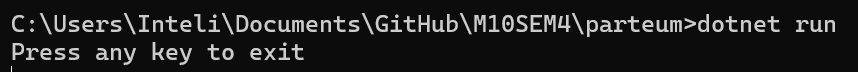

# Questão
Realize as atividades propostas no tutorial "Criando métricas". Você deverá criar um repositório no github e implementar todas as etapas. Crie um arquivo markdown e registre, em forma de relatório, o seu avanço. Adicione ao relatório prints da execução do seu programa exibindo as saidas do console/terminal.

# Barema
**Codificação de todas as etapas - 3 pontos**

**Código e Testes compilando e executando sem erros - 3 pontos**

**Métricas coletadas e evidenciadas no relatório - 2 pontos**

**Commit semântico e Organização do relatório - 1 ponto**

**Relatório em markdown escrito de forma clara, concisa e objetiva - 2 pontos.**

VOCÊS DEVERÃO FAZER APENAS OS DOIS PRIMEIROS EXEMPLOS:O primeiro exemplo é a "Criar uma métrica personalizada". O segundo exemplo é o "Obtenha um Medidor por meio da injeção de dependência"

# Parte 1 - Criar uma métrica personalizada

## Passo 1
- Criação do aplicativo com os comandos:
```
  dotnet new console
  dotnet add package System.Diagnostics.DiagnosticSource
```
- E adicione esse código em Progrma.cs
  
```
  using System;
  using System.Diagnostics.Metrics;
  using System.Threading;

  class Program
  {
      static Meter s_meter = new Meter("HatCo.Store");
      static Counter<int> s_hatsSold = s_meter.CreateCounter<int>("hatco.store.hats_sold");

      static void Main(string[] args)
      {
          Console.WriteLine("Press any key to exit");
          while(!Console.KeyAvailable)
          {
              // Pretend our store has a transaction each second that sells 4 hats
              Thread.Sleep(1000);
              s_hatsSold.Add(4);
          }
      }
  }
```

- Coloque esse comando no terminal para rodar a aplicação:

```
  dotnet run
```


## Passo 2 - Exibir a nova métrica
- Instale a ferramenta dotnet-counters, então coloque esse comando no terminal:

```
  dotnet tool update -g dotnet-counters
```

- Depois coloque esse comando para exibir as métricas:

```
  dotnet-counters monitor -n parteum --counters HatCo.Store
```


# Parte 2 - Obtenha um Medidor por meio da injeção de dependência

A parte do tutorial sobre "Obtenha um Medidor por meio da injeção de dependência" é encontrada na pasta chamada "pastadois". Nessa parte o pricipal assunto é a injeção de depedências (injeção de depedências é um padrão de projeto usado para evitar o alto nível de acoplamento de código dentro de uma aplicação)

A segunda parte do tutorial explica como utilizar a injeção de dependência para obter um objeto Medidor em vez de criar diretamente com new (como foi feito na parte um), mostrando um exemplo de implementação em um aplicativo ASP.NET Core.